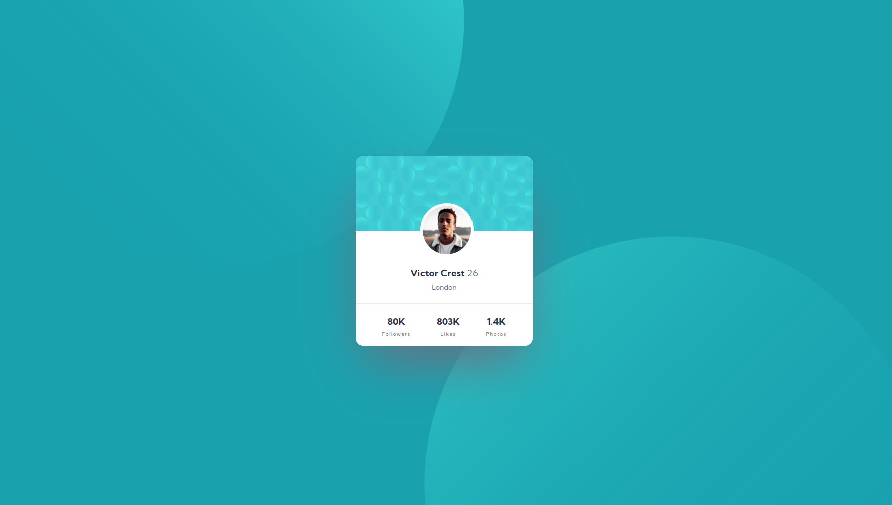

# Frontend Mentor - Profile card component solution

This is a solution to the [Profile card component challenge on Frontend Mentor](https://www.frontendmentor.io/challenges/profile-card-component-cfArpWshJ). Frontend Mentor challenges help you improve your coding skills by building realistic projects. 

## Table of contents

- [Overview](#overview)
  - [The challenge](#the-challenge)
  - [Screenshot](#screenshot)
  - [Links](#links)
- [Author](#author)

## Overview

### The challenge

- Build out the project to the designs provided

### Screenshot

### Links

- Solution URL: [Add solution URL here](https://github.com/HubertKwiatkowski/FM-profile-card-component)
- Live Site URL: [Add live site URL here](https://fm-profile-card-component-tau.vercel.app/)

## Author

- Website - [Hubert Kwiatkowski](https://www.your-site.com)
- Frontend Mentor - [@HubertKwiatkowski](https://www.frontendmentor.io/profile/hubertkwiatkowski)
